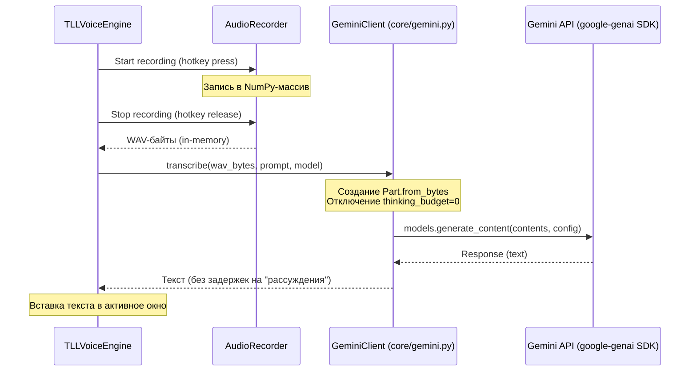

# [TLL-Voice] Архитектура интеграции с Gemini API и управление Thinking Budget

Этот документ описывает архитектуру интеграции голосового помощника TLL-Voice с Gemini API, способ передачи аудиоданных и механизм полного отключения логического мышления (Thinking Budget) модели для снижения задержек (latency).

## Общая архитектура вызова Gemini API

Взаимодействие с API построено по принципу **асимметрии усилий** с обработкой всех данных в оперативной памяти (in-memory) без сохранения промежуточных файлов на диск.



---

## 1. Отключение мышления (Thinking Budget)

Для моделей семейства Gemini (таких как `gemini-2.0-flash` или `gemini-3.1-flash-lite`), поддерживающих шаг рассуждений (thinking config), по умолчанию выделяется время и токены на внутренние рассуждения. Это увеличивает время ожидания (latency) перед началом отдачи текста.

В проекте TLL-Voice **мышление выключено в ноль** с целью мгновенного получения структурированного ASR-лога.

### Реализация в коде ([core/gemini.py](file:///c:/Users/dede/00_project/TLL-Voice/core/gemini.py#L61-L65)):

```python
# Настройка конфигурации генерации контента
config = types.GenerateContentConfig(
    temperature=temperature,
    # Полное отключение лимита на рассуждения для снижения latency
    thinking_config=types.ThinkingConfig(thinking_budget=0)
)
```

При значении `thinking_budget=0` модель сразу переходит к генерации результирующего ответа, минуя этап рассуждений, что снижает время ответа на несколько секунд.

---

## 2. In-Memory передача аудиоданных

Для исключения дискового I/O (ввода-вывода), который создает дополнительную задержку и изнашивает SSD, передача аудио в Gemini API выполняется непосредственно из ОЗУ.

* Записанный поток транслируется в байтовый массив формата WAV.
* API принимает эти данные через объект `types.Part.from_bytes`:

```python
audio_part = types.Part.from_bytes(data=wav_bytes, mime_type="audio/wav")
```

---

## 3. Используемый технологический стек API

* **SDK:** Новый официальный пакет `google-genai` (устаревший `google-generativeai` полностью исключен).
* **Импортируемые модули:**
  ```python
  from google import genai
  from google.genai import types
  ```
